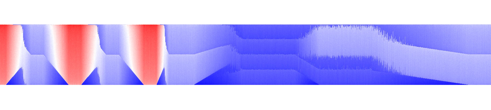

# NetworkRugs

### Ordering Strategies for 1D Pixel Visualization for Dynamic Networks

This project explores compact 1D pixel visualizations, called NetworkRugs, for dynamic networks, using a variety of graph-based metrics and node ordering strategies. Implemented in Python with NetworkX and visualized via Matplotlib, the framework enables comparison of different orderings and experimentation with various color encodings

You can view the project presentation slides [here](assets/BachelorThesis_Presentation_Koerte.pdf)



#### Key Components

##### Interactive Interface
- interface.py: Interface for parameter testing and visualization generation
- data_generation.py: Functions for generating synthetic test data with configurable properties

##### Core Utilities
- orderings.py: Functions for generating different node orderings
- visualization.py: Functions for creating the NetworkRug visualizations
- network_rugs.py: NetworkRugs generation functionality
- color.py: Functionality for color mapping
- neighborhoods.py: Functions related to graph neighborhoods


##### Usage
1. Install dependencies:
```bash
pip install -r requirements.txt
```

2. Launch the interface in a Jupyter Notebook (e.g., demo.ipynb):
```
import ba_utils.interface as interface
interface.start_gui()
```


